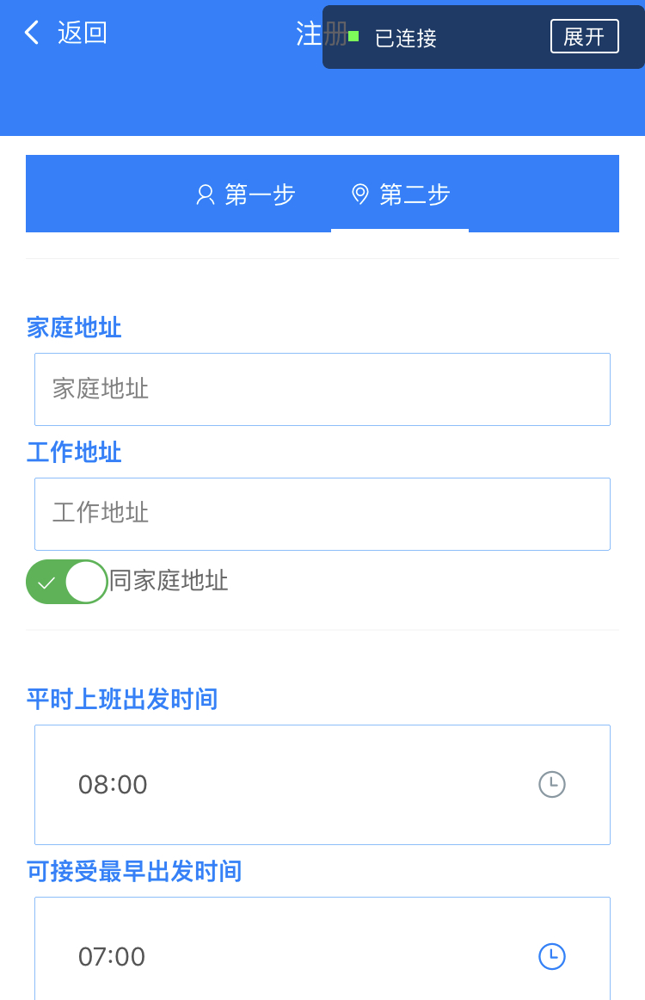
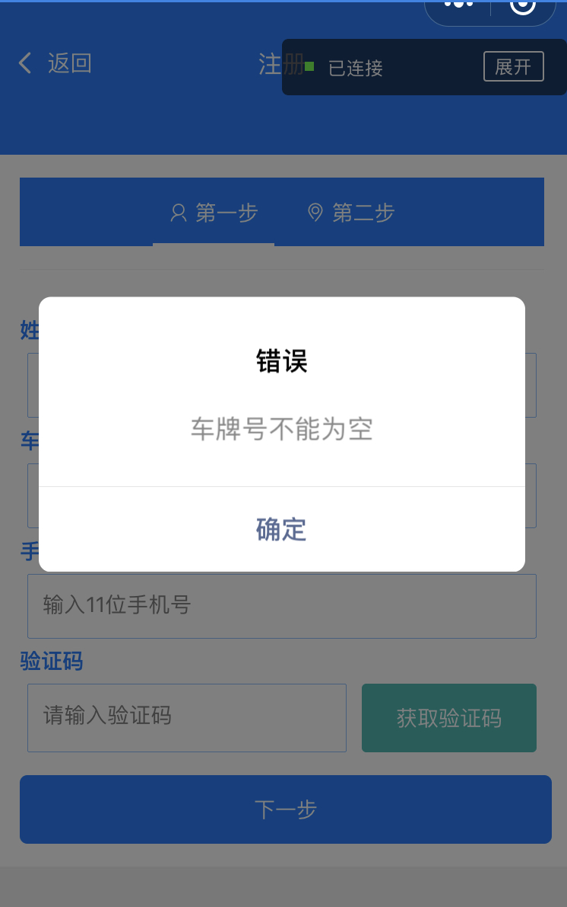
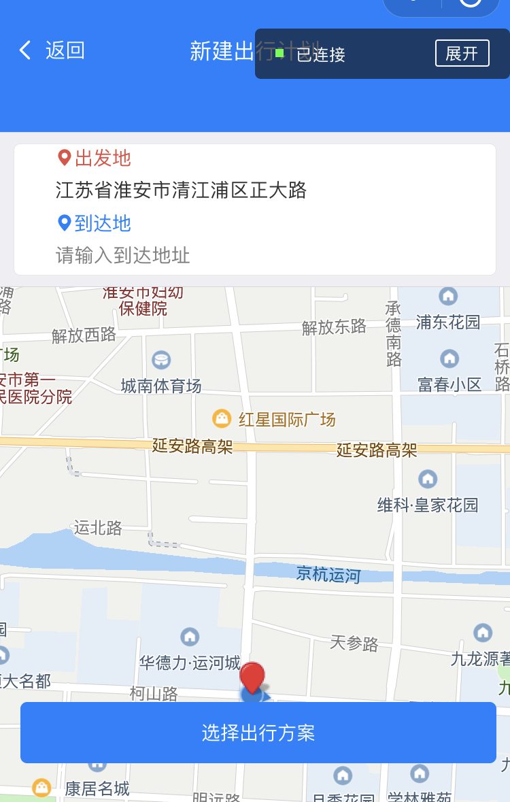
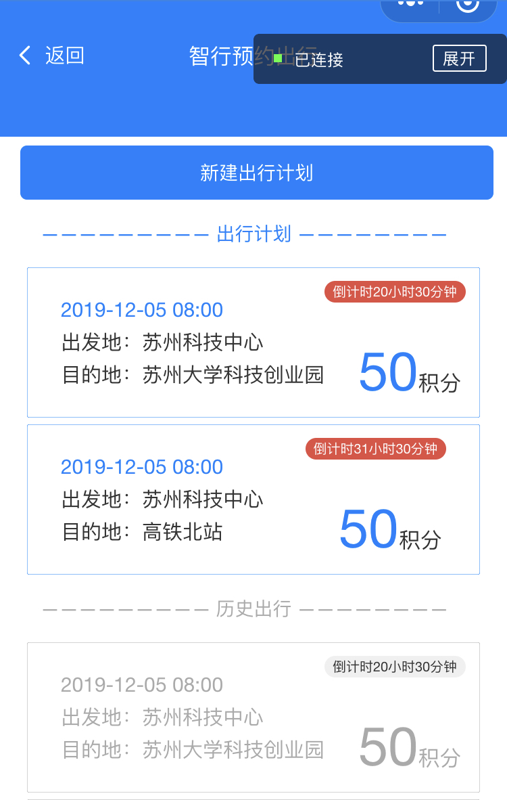
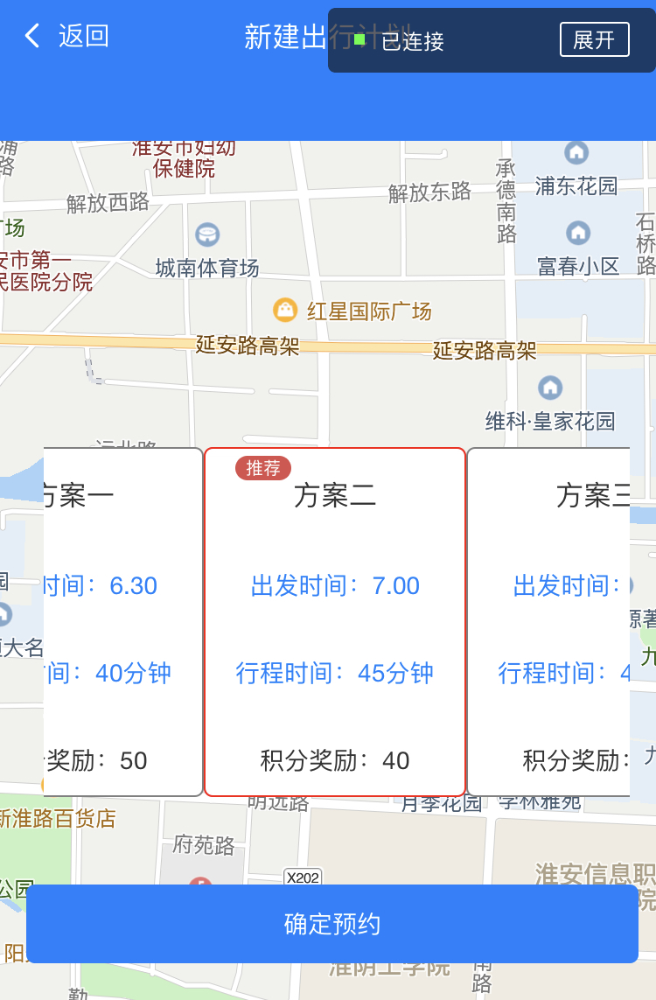

# djt_wx
通过微信小程序原生框架+colorUi库+百度地图 完成了一个用户注册，收集用户出发时间，为用户推荐出行方案的微信小程序

### 首先得先去微信开发者官网申请appId,之后将Fork的项目在微信开发者工具中import

### 小程序完成了对用户信息收集，对用户输入进行校验，通过百度地图逆地址解析api获取用户当前地址，为用户推荐最佳的出行方案

## 页面展示
          
  
